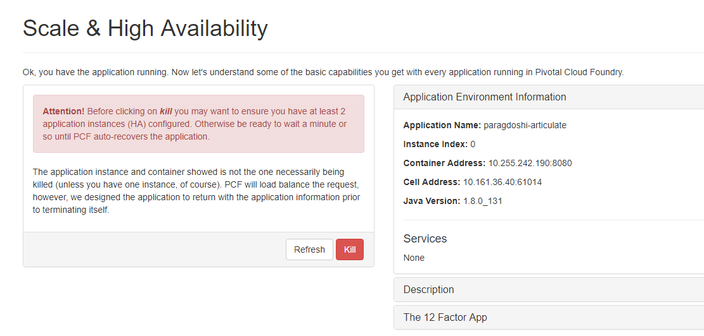

= Lab 3 - Monitoring, Metrics and HA Lab

[abstract]
--
Pivotal Cloud Foundry makes the work of performing actions, such as managing logs, doing a zero-downtime deploy, and managing application health very easy.
In the this labs we'll explore some of these capabilities.
--

== Tailing Application Logs

One of the most important enablers of visibility into application behavior is logging.
Effective management of logs has historically been difficult or required wiring into third party tools.
Cloud Foundry's https://docs.pivotal.io/pivotalcf/1-9/loggregator/architecture.html[log aggregation] components simplify log management by assuming responsibility for it.
Application developers need only log all messages to either 'System.out' in Java or  `STDOUT` or `STDERR` in other languages, and the platform will capture these messages.

=== For Developers

Application developers can view application logs using the CF CLI.

. Let's view recent log messages for the application.
+
----
> cf logs paragdoshi-articulate --recent
----
+
Here are some interesting subsets of one output from that command:
+
.CF Component Logs
====
----
> cf logs paragdoshi-articulate --recent
Retrieving logs for app paragdoshi-articulate in org training / space training as parag...

   2017-09-04T13:45:01.14+0000 [APP/PROC/WEB/1] OUT 2017-09-04 13:45:01.141  INFO 19 --- [           main] o.s.j.e.a.AnnotationMBeanExporter        : Located managed bean 'configu
rationPropertiesRebinder': registering with JMX server as MBean [org.springframework.cloud.context.properties:name=configurationPropertiesRebinder,context=155fd50e,type=Configurat
ionPropertiesRebinder]
   2017-09-04T13:45:01.14+0000 [APP/PROC/WEB/1] OUT 2017-09-04 13:45:01.149  INFO 19 --- [           main] o.s.j.e.a.AnnotationMBeanExporter        : Located managed bean 'refresh
Endpoint': registering with JMX server as MBean [org.springframework.cloud.bootstrap.config:name=refreshEndpoint,type=RefreshEndpoint]
   2017-09-04T13:45:01.19+0000 [APP/PROC/WEB/1] OUT 2017-09-04 13:45:01.195  INFO 19 --- [           main] c.n.h.c.m.e.HystrixMetricsPoller         : Starting HystrixMetricsPoller
   2017-09-04T13:45:01.19+0000 [APP/PROC/WEB/1] OUT 2017-09-04 13:45:01.197  INFO 19 --- [           main] ration$HystrixMetricsPollerConfiguration : Starting poller
   2017-09-04T14:14:48.91+0000 [RTR/1] OUT paragdoshi-articulate.apps.ourpcf.com - [2017-09-04T14:14:48.911+0000] "OPTIONS /cloudfoundryapplication HTTP/1.1" 403 0 20 "-" "Mozilla
/5.0 (Windows NT 10.0; Win64; x64) AppleWebKit/537.36 (KHTML, like Gecko) Chrome/60.0.3112.113 Safari/537.36" "10.161.33.196:54922" "10.161.36.40:61014" x_forwarded_for:"172.31.41
.185" x_forwarded_proto:"https" vcap_request_id:"70917a49-9284-4a64-5e93-2bfe9c7468c7" response_time:0.002831507 app_id:"44d15f9d-de29-4e53-9898-4b289d0211d7" app_index:"0" x_b3_t
raceid:"3b19d3bef9797431" x_b3_spanid:"3b19d3bef9797431" x_b3_parentspanid:"-"
   2017-09-04T14:14:48.91+0000 [RTR/1] OUT
   2017-09-04T14:14:50.66+0000 [APP/PROC/WEB/1] OUT 2017-09-04 14:14:50.669  INFO 19 --- [nio-8080-exec-1] o.a.c.c.C.[Tomcat].[localhost].[/]       : Initializing Spring Framework
Servlet 'dispatcherServlet'

----
<1> An ``Apache-style'' access log event from the (Go)Router
<2> An API log event that corresponds to an event as shown in `cf events`
<3> A RTR log event indicating the routing of a request to an application instance.
====

As you can see, Cloud Foundry's log aggregation components capture both application logs and CF component logs relevant to your application.
These events are properly interwoven based on time, giving you an accurate picture of events as they transpired across the system. 

. To get a running ``tail'' of the application logs rather than a dump, simply type:
+
----
> cf logs paragdoshi-articulate
----
+
You can try various things like refreshing the browser and triggering stop/start events to see logs being generated.

== Health Management

Cloud Foundry's https://docs.pivotal.io/pivotalcf/1-9/concepts/architecture/#nsync-bbs[components] actively monitors the health of our application processes and will restart them should they crash.

. If you don't have one already running, start a log tail for your articulate application. 
+
----
> cf logs paragdoshi-articulate
Retrieving logs for app paragdoshi-articulate in org training / space training as parag...
----

. If you do not have more than one application instance running, execute the scale command to scale to 2 or more application instances.  Visit the application in the browser, click on 'Scale & HA' link and click on the `Kill' button. This button will trigger an Environment.Exit(-1) causing the Health Manager to observe an application instance crash:
+

. After clicking the kill  a couple of interesting things should happen.
First, you'll see that the application continues to service requests as all requests will now be serviced by the remaining instance (#1 in this example)
+
image::../../Common/images/ha-instance.png[]
+
Also, if you're paying attention to the log tail, you'll see some interesting log messages fly by :
+
====
----
   2017-09-04T14:54:37.62+0000 [CELL/1] OUT Exit status 0
   2017-09-04T14:54:37.62+0000 [APP/PROC/WEB/1] OUT Exit status 0
   2017-09-04T14:54:37.64+0000 [CELL/1] OUT Destroying container
   2017-09-04T14:54:37.64+0000 [CELL/1] OUT Stopping instance 34f88e2a-7091-4e7d-7fe2-2234
   2017-09-04T14:54:37.65+0000 [API/1] OUT Process has crashed with type: "web"
   2017-09-04T14:54:37.67+0000 [CELL/1] OUT Creating container
   2017-09-04T14:54:37.66+0000 [API/1] OUT App instance exited with guid 44d15f9d-de29-4e53-9898-4b289d0211d7 payload: {"instance"=>"34f88e2a-7091-4e7d-7fe2-2234", "index"=>1, "re
ason"=>"CRASHED", "exit_description"=>"Codependent step exited", "crash_count"=>1, "crash_timestamp"=>1504536877621002624, "version"=>"70798fbe-a1e6-4a87-98da-9e95f0f8b763"}
   2017-09-04T14:54:37.95+0000 [CELL/1] OUT Successfully destroyed container
   2017-09-04T14:54:37.95+0000 [CELL/1] OUT Successfully created container
   2017-09-04T14:54:38.32+0000 [CELL/1] OUT Starting health monitoring of container

----
<1> Just before issuing the `Environment.Exit(-1)` call, the application logs that the kill switch was clicked.
<2> The (Go)Router routes requests to the remaining app instance.
<3> The API logs that an application instance exited due to a crash.
<4> And almost immediately, a new container is created and another application instance is started by the platform.
====

Hit CTRL + C to stop tailing the logs.

. Revisiting the *HOME PAGE* of the application and you should see a fresh instance started:
+

== Viewing Application _Events_

Cloud Foundry only allows application configuration to be modified via its API.
This gives application operators confidence that all changes to application configuration are known and auditable.
It also reduces the number of causes that must be considered when problems arise.

All application configuration changes are recorded as _events_.
These events can be viewed via the Cloud Foundry API, and viewing is facilitated via the CLI.

Take a look at the events that have transpired so far for our deployment of `workshop`:

====
----
> cf events paragdoshi-articulate
Getting events for app paragdoshi-articulate in org training / space training as parag...

time                          event                     actor                   description
2017-09-04T14:54:37.00+0000   app.crash                 paragdoshi-articulate   index: 1, reason: CRASHED, exit_description: Codependent step exited
2017-09-04T14:54:37.00+0000   audit.app.process.crash   web                     index: 1, reason: CRASHED, exit_description: Codependent step exited
2017-09-04T14:52:43.00+0000   audit.app.update          parag                   instances: 2
2017-09-04T14:37:45.00+0000   audit.app.update          parag
2017-09-04T14:37:45.00+0000   audit.app.map-route       parag
2017-09-04T14:35:55.00+0000   audit.app.update          parag
2017-09-04T14:35:55.00+0000   audit.app.unmap-route     parag
2017-09-04T14:34:25.00+0000   audit.app.update          parag                   instances: 1
2017-09-04T13:44:51.00+0000   audit.app.update          autoscaling_service     instances: 2
2017-09-04T01:28:05.00+0000   audit.app.update          parag                   instances: 1
2017-09-04T01:21:20.00+0000   audit.app.update          parag                   instances: 3
2017-09-03T23:38:37.00+0000   audit.app.update          parag                   instances: 1
2017-09-03T23:36:45.00+0000   audit.app.update          parag                   instances: 3
2017-09-03T23:00:50.00+0000   audit.app.update          parag                   state: STARTED
2017-09-03T23:00:38.00+0000   audit.app.update          parag
2017-09-03T23:00:38.00+0000   audit.app.map-route       parag
2017-09-03T23:00:38.00+0000   audit.app.create          parag                   disk_quota: 1024, instances: 1, memory: 1024, state: STOPPED, environment_json: PRIVATE DATA HIDDEN
----
<1> Events are sorted newest to oldest, so we'll start from the bottom.
Here we see the `app.create` event, which created our application's record and stored all of its metadata (e.g. `memory: 1024`).
<2> The `app.map-route` event records the incoming request to assign a route to our application.
<3> An `app.update` event records the resulting change to our applications metadata.
<4> An `app.update` event records the change of our application's state to `STARTED`.
<5> Remember scaling the application up? An `app.update` event records the metadata change `instances: 2`.
<6> Also there's the `app.process.crash` event recording that we encountered a crash of an application instance.
====

. Let's explicitly ask for the application to be stopped:
+
----
> cf stop paragdoshi-articulate
Stopping app paragdoshi-articulate in org training / space training as parag...
OK

----

. Now, examine the additional `app.update` event:
+
----
> cf events paragdoshi-articulate
Getting events for app paragdoshi-articulate in org training / space training as parag...

time                          event                     actor                   description
2017-09-04T16:50:27.00+0000   audit.app.update          parag                   state: STOPPED

----

. Start the application again:
+
----
> cf start paragdoshi-articulate
Starting app paragdoshi-articulate in org training / space training as parag...

Waiting for app to start...

name:              paragdoshi-articulate
requested state:   started
instances:         2/2
usage:             1G x 2 instances
routes:            paragdoshi-articulate.apps.ourpcf.com
last uploaded:     Sun 03 Sep 23:00:45 GMT 2017
stack:             cflinuxfs2
buildpack:         container-security-provider=1.5.0_RELEASE java-buildpack=v3.18-offline-https://github.com/cloudfoundry/java-buildpack.git#841ecb2 java-main open-jdk-like-jre=1.8.0_131
                   open-jdk-like-memory-calculator=2.0.2_RELEASE open-jdk-like-security-providers secur...
start command:     CALCULATED_MEMORY=$($PWD/.java-buildpack/open_jdk_jre/bin/java-buildpack-memory-calculator-2.0.2_RELEASE -memorySizes=metaspace:64m..,stack:228k..
                   -memoryWeights=heap:65,metaspace:10,native:15,stack:10 -memoryInitials=heap:100%,metaspace:100% -stackThreads=300 -totMemory=$MEMORY_LIMIT) &&
                   JAVA_OPTS="-Djava.io.tmpdir=$TMPDIR -XX:OnOutOfMemoryError=$PWD/.java-buildpack/open_jdk_jre/bin/killjava.sh $CALCULATED_MEMORY
                   -Djava.ext.dirs=$PWD/.java-buildpack/container_security_provider:$PWD/.java-buildpack/open_jdk_jre/lib/ext
                   -Djava.security.properties=$PWD/.java-buildpack/security_providers/java.security" && SERVER_PORT=$PORT eval exec $PWD/.java-buildpack/open_jdk_jre/bin/java $JAVA_OPTS
                   -cp $PWD/. org.springframework.boot.loader.JarLauncher

     state     since                  cpu    memory         disk           details
#0   running   2017-09-04T16:51:56Z   0.0%   160.4M of 1G   154.6M of 1G
#1   running   2017-09-04T16:51:57Z   0.0%   332.9M of 1G   154.6M of 1G

----

. And again, view the additional `app.update` event:
+
----
> cf events paragdoshi-articulate
Getting events for app paragdoshi-articulate in org training / space training as parag...

time                          event                     actor                   description
2017-09-04T16:51:43.00+0000   audit.app.update          parag                   state: STARTED
----

== PCF Metrics

. Along with the logs and events streams, application developers and operators have another tool available to them to monitor the health of their applications - PCF Metrics. And this tool can be accessed by clicking the 'View in PCF Metrics' link for your application in PCF. Log in with your credentials if redirected to log in page.
+

. You can view Events, Container and Network metrics and also the logs in one easy to use interface. 
+

This completes the lab for Monitoring, Metrics and HA !

